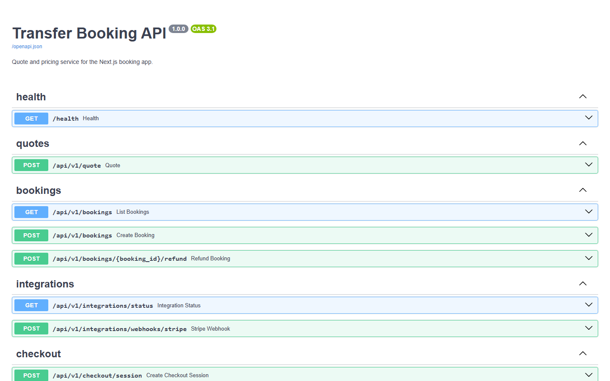
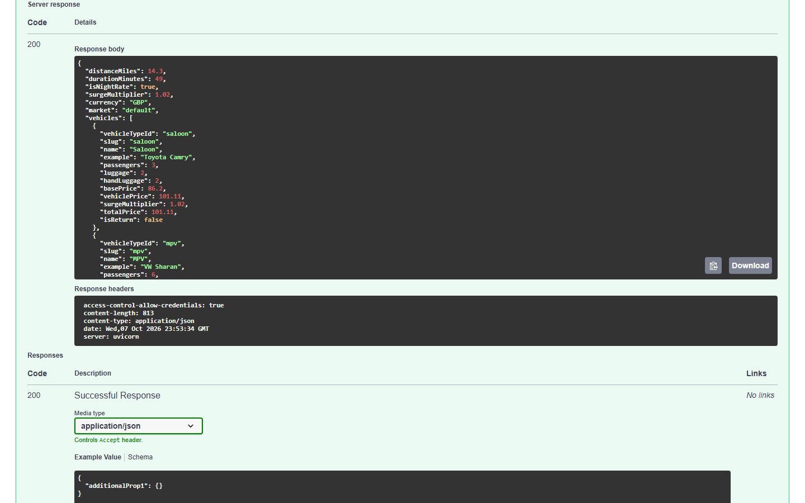

# Booking API (FastAPI)

## Screenshots





Pricing, quote and booking service for a transfer-booking web app. It calculates trip quotes from coordinates (haversine distance, three vehicle tiers, night and weekend surge multipliers, market-specific fares), keeps an in-memory booking list, and can create Stripe Checkout sessions.

There are two entry points in this repo:

| Entry | Location | Contents |
|---|---|---|
| Legacy | `app.main:app` (repo root, `app/`) | health + quote only |
| Backend (current) | `backend/` (`src.main:backend_app`) | quote, bookings, checkout, integrations |

## Tech stack

| Area | Technologies |
|------|--------------|
| Backend | `Python`, `FastAPI`, `Pydantic Settings`, `httpx`, `Uvicorn` |
| Database | `SQLAlchemy (async)`, `SQLite (aiosqlite)` |
| Auth and payments | `JWT (python-jose)`, `passlib`, `Stripe Checkout` |
| DevOps and tooling | `Docker`, `pytest`, `mypy` |

## Run

Legacy entry (from the repo root):

```powershell
python -m venv .venv
.\.venv\Scripts\activate
pip install -r requirements.txt
uvicorn app.main:app --reload --port 8010
```

Backend entry:

```powershell
cd backend
python -m venv .venv
.\.venv\Scripts\activate
pip install -r requirements.txt
copy .env.example .env
$env:PYTHONPATH="src"
uvicorn src.main:backend_app --reload --port 8010
```

Interactive docs: http://127.0.0.1:8010/docs. `backend/Dockerfile` runs the backend entry on port 8000 (build context `backend/`).

Settings come from `.env`: `MARKET` (`default`, `uk` or `brazil`), `CORS_ORIGINS` (defaults to `http://localhost:3000`) and `DEFAULT_CURRENCY`. Stripe, SendGrid, Google Maps and analytics keys are optional environment variables; `GET /api/v1/integrations/status` shows which are set.

## Endpoints

Backend entry (the legacy entry only has `GET /health` and `POST /api/v1/quote`):

- `GET /health`
- `POST /api/v1/quote`
- `GET /api/v1/bookings`, `POST /api/v1/bookings`
- `POST /api/v1/bookings/{booking_id}/refund`
- `POST /api/v1/checkout/session` (returns a demo session unless `STRIPE_SECRET_KEY` is set; the `stripe` package must be installed for live Checkout)
- `GET /api/v1/integrations/status`
- `POST /api/v1/integrations/webhooks/stripe`

## Examples

```bash
curl -X POST http://127.0.0.1:8010/api/v1/quote \
  -H "Content-Type: application/json" \
  -d '{"pickupLat":51.5074,"pickupLng":-0.1278,"dropoffLat":51.47,"dropoffLng":-0.4543,"pickupDate":"2025-06-14","pickupTime":"23:30","isReturn":false}'

curl -X POST http://127.0.0.1:8010/api/v1/bookings \
  -H "Content-Type: application/json" \
  -d '{"destination":"Heathrow Terminal 5","travelers":2,"start_date":"2025-06-14","email":"guest@example.com"}'

curl -X POST http://127.0.0.1:8010/api/v1/checkout/session \
  -H "Content-Type: application/json" \
  -d '{"amount_cents":8500,"currency":"gbp","email":"guest@example.com"}'
```

## Tests

Covers both the legacy entry (`app.main:app`) and the backend entry (`src.main:backend_app`).

```bash
pip install -r requirements.txt -r backend/requirements.txt -r requirements-dev.txt
python -m pytest -q
```

## Author

**Alexsandro Sunaga**

## License

MIT License — see [LICENSE](LICENSE).
